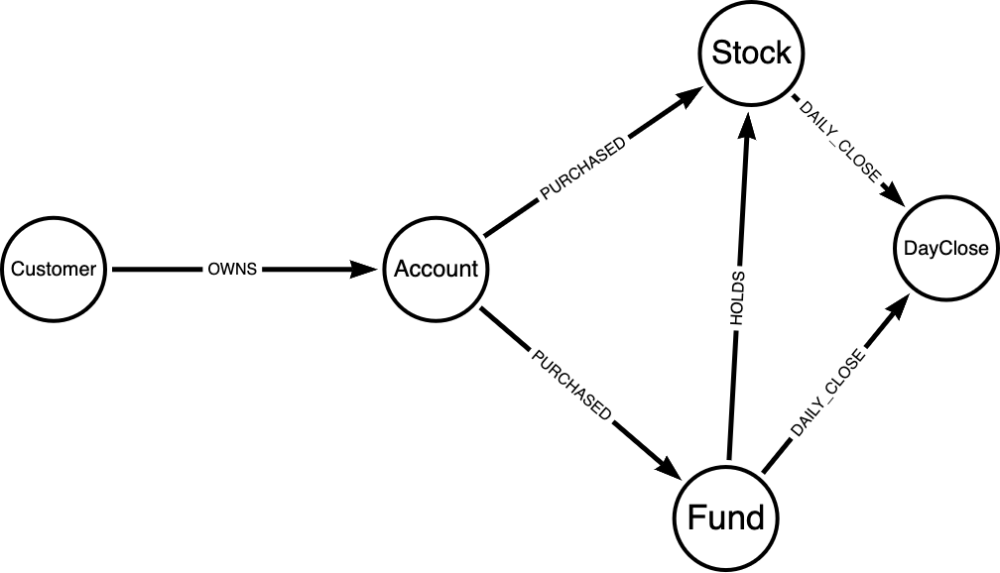
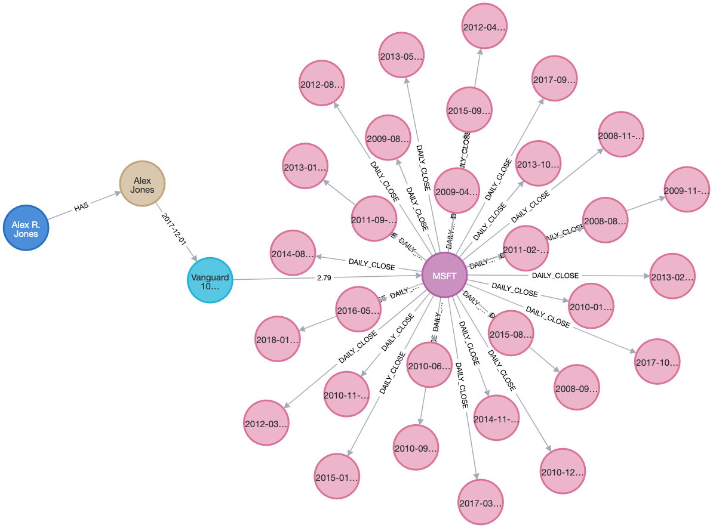

# Introduction

This is my attempt to load and query financial data into Neo4J, and answer questions about the graph that I built on the data.

This financial data represents [customers](customers.csv), their [investment accounts](accounts.csv), [purchases made](account_purchases.csv) by those accounts in terms of [mutual funds](funds.csv) and [stocks](stock_ticker.csv), and the [daily values of individual stocks](daily_close.csv).

We load data and build relationships between them following the graph model below drawn using the [arrows web-app](https://arrows.app) in Section 1 of this README. We then answer questions about this graph model in Section 2 onwards.

I used a Neo4J sandbox instance: `neo4j+s://97cceae5d9a9d470b3f1a914a5a3d9c0.bolt.neo4jsandbox.com:443` in the Browser for this exercise.



Following successful loading and building of the graph model, an example query result fulfilling some of the graph model details above is below.



# Section 1

#### Cypher Queries for loading data

```
//load customers 
LOAD CSV WITH HEADERS FROM 'https://raw.githubusercontent.com/nxrmrz/neo4j-sandbox/main/customers.csv' AS row
CREATE (c:Customer)
SET c += row

//load accounts
LOAD CSV WITH HEADERS FROM 'https://raw.githubusercontent.com/nxrmrz/neo4j-sandbox/main/accounts.csv' AS row
CREATE (ac:Account)
SET ac += row

//load accounts purchases
LOAD CSV WITH HEADERS FROM 'https://raw.githubusercontent.com/nxrmrz/neo4j-sandbox/main/account_purchases.csv' AS row
CREATE (ap:AccountPurchase)
SET ap += row

//load funds
LOAD CSV WITH HEADERS FROM 'https://raw.githubusercontent.com/nxrmrz/neo4j-sandbox/main/funds.csv' AS row
CREATE (f:Fund)
SET f += row

//load fund holdings
LOAD CSV WITH HEADERS FROM 'https://raw.githubusercontent.com/nxrmrz/neo4j-sandbox/main/fund_holdings.csv' AS row
CREATE (fh:FundHolding)
SET fh += row

//load stock tickers
LOAD CSV WITH HEADERS FROM 'https://raw.githubusercontent.com/nxrmrz/neo4j-sandbox/main/stock_ticker.csv' AS row
CREATE (st:StockTicker)
SET st += row

//load daily close
LOAD CSV WITH HEADERS FROM 'https://raw.githubusercontent.com/nxrmrz/neo4j-sandbox/main/daily_close.csv' AS row
CREATE (dc:DailyClose)
SET dc += row
```

#### Cypher queries for building relationships between nodes

```
//build relationship between customer and account
MATCH (c:Customer)
MATCH (a:Account)
WHERE c.customer_id = a.customer_id
MERGE (c)-[:OWNS]->(a)

//build relationship between account and holdings (stock only)
MATCH (ac: Account)
MATCH (ap:AccountPurchase)
MATCH (st:StockTicker)
WHERE ac.account_id = ap.account_id and ap.ticker = st.ticker 
// ^above ensures only stock tickers are used to create Stock node
MERGE (ac)-[r:PURCHASED]->(st)
ON CREATE SET r.purchaseDate = ap.purchaseDate,
r.quantity = ap.number_of_shares

//build relationship between account and fund
MATCH (ac:Account)
MATCH (ap:AccountPurchase)
MATCH (f:Fund)
WHERE ac.account_id = ap.account_id AND ap.ticker = f.ticker
MERGE (ac)-[r:PURCHASED]->(f)
ON CREATE SET r.purchaseDate = ap.purchase_date,
r.quantity = ap.number_of_shares

//build relationship between fund and fund holdings (stock)
MATCH (f:Fund)
MATCH (fh:FundHolding)
MATCH (st:StockTicker)
WHERE f.ticker = fh.fund_ticker and fh.holding_ticker = st.ticker
MERGE (f)-[r:HOLDS]->(st)
ON CREATE SET r.percentageAsset = fh.percentage

//build relationship between stock and close
MATCH (st:StockTicker)
MATCH (d:DailyClose)
WHERE st.ticker = d.ticker
MERGE (st)-[:DAILY_CLOSE]->(d)

//build relationship between fund and close
MATCH (f:Fund)
MATCH (d:DailyClose)
WHERE f.ticker = d.ticker
MERGE (f)-[:DAILY_CLOSE]->(d)
```

# Section 2

#### Querying the data

2a. Find all Accounts that own MSFT stock directly through an individual account.
```
MATCH p=()-[]->(ac:Account {account_type: 'Individual'})-[:PURCHASED]->(:StockTicker {ticker: 'MSFT'}) RETURN p
```

2b. Find all Accounts that hold MSFT through a mutual fund.
```
MATCH p=()-[*1..]->(:Fund)-[:HOLDS]->(:StockTicker {ticker: 'MSFT'}) RETURN p
```

2c. Return a count of the number of times a fund holds a stock, sorted in descending count order.
```
MATCH (f:Fund)-[:HOLDS]->(st:StockTicker)
WITH st.ticker as stock, count(DISTINCT f.ticker) as numFundsOwning
RETURN stock, numFundsOwning
ORDER BY numFundsOwning DESC
```

2d. Return the value of mutual fund holdings owned by ‘Ed Chowder’ close date = 5/15/18. Calculate the value of the fund holdings and order by fund name.

The formula in pseudocode would be:
```
- Filter our graph to only have Ed Chowder's mutual holdings and their Daily Close values on 2018-05-15
- For each holding, get the percentage that holding represents in the fund's assets, divide that by 100, and multiply this by the fund's total asset amount
- The result above is multiplied to the holding's close value
- Then the result above is summed up for all holdings in each fund.
```

In cypher query, the above is:
```
MATCH p=(c:Customer {owner_name: 'Ed Chowder'})-[*1..]->(f:Fund)-[h:HOLDS]->()-[]->(d:DailyClose {date: '2018-05-15'})
WITH c.owner_name as customerName, 
f.fund_name as fundName, 
sum((TOFLOAT(f.assets) * (TOFLOAT(h.percentageAsset)/100) * TOFLOAT(d.close))) as totalHoldingsValue
RETURN customerName, fundName, totalHoldingsValue
ORDER BY fundName
```

# Section 3 (Bonus)

3a. Return account owner name(s) and account type(s) that own MSFT stock directly through an individual account or through a mutual fund. You do not have to count the number of account types a person owns (e.g. owner has more than one account type “Individual”)

```
MATCH p=(c:Customer)-[]->(a:Account)-[*1..]->(st:StockTicker {ticker: 'MSFT'})
RETURN c.owner_name, a.account_type, st.ticker
ORDER BY c.owner_name
```
3b. Return account owner name(s), account type(s), the fund or stock they own and total the value for the last day in the daily trading data. Do not hard code the last day in the query.

```
MATCH (c:Customer)-[:HAS]->(ac:Account)-[p:PURCHASED]->(h)-[*0..1]->()-[:DAILY_CLOSE]->(d)
WITH c.owner_name as customer, ac.account_type as account, TOFLOAT(p.quantity) as numBought, h.ticker as ticker, d order by d.date DESC
WITH customer, account, numBought, ticker, TOFLOAT(collect(d)[0].close) as lastDayClose
WITH customer, account, numBought, ticker, SUM(lastDayClose) as totalClose
RETURN customer, account, ticker, numBought * totalClose as value
ORDER BY customer
```

3c. Any other interesting queries or observations about the model you built and the types of queries that it entails.

I noticed a few things:
- The input tables are quite denormalised, allowing you to inspect high level account performance, and low level/granular stock performance to the day
- Some customer accounts dont have names
- Fund holdings percentages don't sum up to 100 - possible that they hold not just a bunch of stocks, but assets somewhere else not indicated in `StockTicker` table?
- The model we built has `DailyClose` nodes for each stock/fund (i.e. each holding). This could result to performance or memory problems if the number of holdings balloons, as each holding would have at least 30 nodes. Say it balloons to 1000. We'd then need to create `1000 * 30 = 30,000` new nodes.
    - A potential fix is to create, per holding, a reduced number of nodes indicating a time period (i.e. a single node for the month? A single node for the quarter?) and each node would have _arrays_ of daily values: highs, lows, closes, volumes, etc. This allows us to _index_ to retrieve a specific daily value or property, as opposed to doing node traversal/search on a large number of items.

A clarification I need to make:
- I need to clarify the formula for calculating total fund performance. I have indicated my reasoning in Section 2d, but it doesn't fit the answer in the pdf.